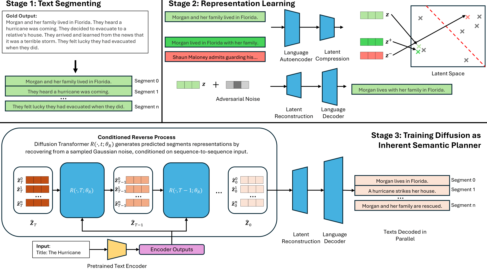

# Segment-Level Diffusion: A Framework for Controllable Long-Form Text Generation

<div align="center">



*A framework for controllable long-form generation with diffusion language models*

[](https://arxiv.org/abs/2412.11333)
[](LICENSE)
[](https://python.org)
[](https://pytorch.org)

</div>

## 📖 Abstract

This repository contains the official implementation of **Segment-Level Diffusion (SLD)**, a framework that addresses significant challenges in diffusion-based text generation for long, coherent sequences. Our approach enhances diffusion models through text segmentation, robust representation training, and improved controllability for long-form text generation.

### Environment Setup

```bash
# Clone the repository
git clone https://github.com/yourusername/Segment_Level_Diffusion.git
cd Segment_Level_Diffusion

# Create conda environment
conda create -n sld python=3.8
conda activate sld

# Install dependencies
pip install -r requirements.txt

# Install spaCy models (required for evaluation)
python -m spacy download en_core_web_sm
python -m spacy download en_core_web_lg
```

### Wandb Setup (Optional)
```bash
# For experiment tracking
wandb login
export WANDB_PROJECT="segment_level_diffusion"
```

## 📂 Repository Structure

```
├── dataset_utils/          # Data loading and preprocessing utilities
│   ├── ae_dataset.py       # Autoencoder dataset classes
│   ├── noiser.py          # Text noising strategies
│   └── sentence_dataset.py # Sentence-level dataset handling
├── datasets/              # Example datasets and data augmentation
│   ├── example_roc_*      # ROC story datasets
│   └── data_augmentation.py
├── diffusion/             # Core diffusion model implementation
│   ├── gaussian_diffusion.py      # Gaussian diffusion process
│   ├── sentence_denoising_diffusion.py  # Main diffusion trainer
│   └── optimizer.py       # Custom optimizers
├── latent_models/         # Latent representation models
│   ├── bart_latent_model.py    # BART-based latent model
│   ├── t5_latent_model.py      # T5-based latent model
│   └── latent_utils.py    # Latent model utilities
├── model/                 # Neural network architectures
│   ├── diffusion_transformer.py  # Main diffusion transformer
│   └── x_transformer.py   # Enhanced transformer implementation
├── evaluation/            # Evaluation scripts and metrics
│   ├── evaluation.py      # Evaluation utilities
│   └── *.ipynb           # Analysis notebooks
└── utils/                 # General utilities
    ├── simcse.py          # SimCSE for contrastive learning
    └── torch_utils.py     # PyTorch utilities
```
# Documentation

## Dataset
Dataset examples are provided under the `datasets` folder.

## Training Process

### Step 1: Train Latent Encoder and Decoder
To start training, you should first train the latent encoder and decoder components. An example training script is provided as `train_latent.sh`.

For detailed documentation of all available arguments, please refer to `train_latent_model.py`.

### Step 2: Train Diffusion Model
After the latent encoder and decoder components are trained, you should train the segment-level diffusion language model using `train_segment_diffusion.py`. This script also contains detailed argument documentation. An example run is provided in `train_diffusion.sh`.

## Noise Implementation
In `noiser.py`, we include both contrastive and adversarial noise implementations. For adversarial noise specifically we implemented the following:
- **Adversarial noise**: Implemented based on Miyato et al. 2017 (https://arxiv.org/abs/1605.07725)
- **Virtual adversarial noise**: Also implemented from the same paper, but our implementation is numerically unstable and was not used in our paper.

## Inference
Use `inference.sh` for model inference.

## 📋 Citation

If you use this code in your research, please cite our paper:

```bibtex
@article{zhu2024segment,
  title={Segment-Level Diffusion: A Framework for Controllable Long-Form Generation with Diffusion Language Models},
  author={Zhu, Xiaochen and others},
  journal={arXiv preprint arXiv:2412.11333},
  year={2024}
}
```

## 📄 License

This project is licensed under the MIT License - see the [LICENSE](LICENSE) file for details.

## 🔗 Acknowledgments

- Special thanks to **Jack Lovelace et al.** for their foundational work on [Latent Diffusion for Language Generation](https://arxiv.org/pdf/2212.09462). Our implementation builds upon their excellent codebase: [latent-diffusion-for-language](https://github.com/justinlovelace/latent-diffusion-for-language)
- **Meta's Large Concept Model**: Check out [Large Concept Model](https://github.com/facebookresearch/large_concept_model), a pretrained diffusion language model with similar architecture ([paper](https://arxiv.org/pdf/2412.08821))
- **Comprehensive Guide**: For those interested in learning more about diffusion language models, we recommend this [comprehensive blog post](https://spacehunterinf.github.io/blog/2025/diffusion-language-models/) that covers the field in detail

